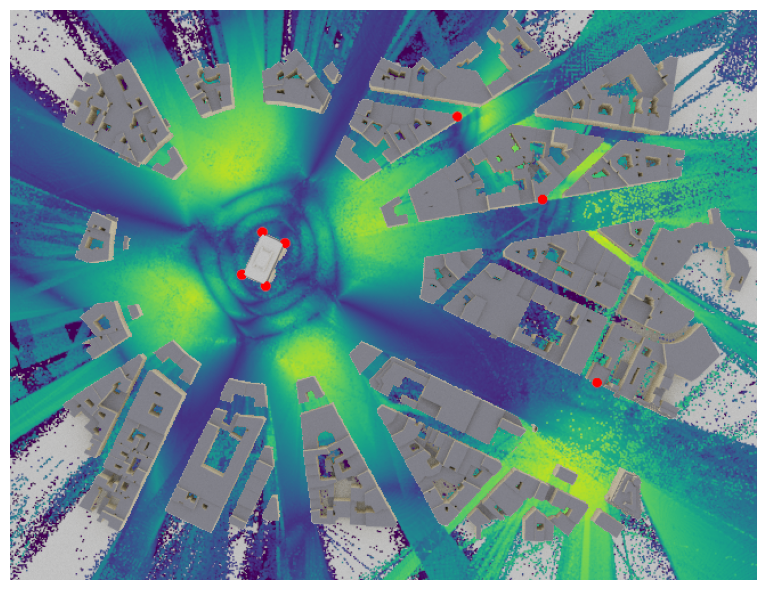
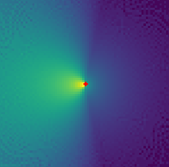
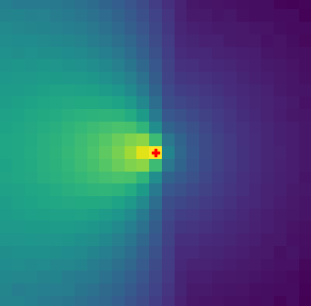

# RaySR (pronounced “Racer”)
:signal_strength: This project aims to enhance Radio Maps with Super Resolution and is inspired by [DLSS](https://www.nvidia.com/en-gb/geforce/technologies/dlss/). The project is part of the course [DD2430](https://www.kth.se/student/kurser/kurs/DD2430?l=en) at KTH and is done in collaboration with Ericsson.

  
  
     
    <em>Left:</em> Example of a radio map scene with transmitters (red). <em>Right:</em> Example of a radio map over San Francisco.
     
  
  
     
    <em>Left:</em> High-resolution radio map. <em>Right:</em> Example of "downsampled" low-resolution radio map.

## Setup
1) Install [uv](https://github.com/astral-sh/uv).
2) Sync env with `uv sync` (creates a virtual environment in `.venv`).
3) You can activate the virtual environment with `source .venv/bin/activate` and deactivate with `deactivate` OR just run `uv run <command>` to run commands in the virtual environment.
4) Install the pre-commit hooks with `pre-commit install` (for development).
