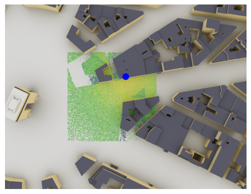
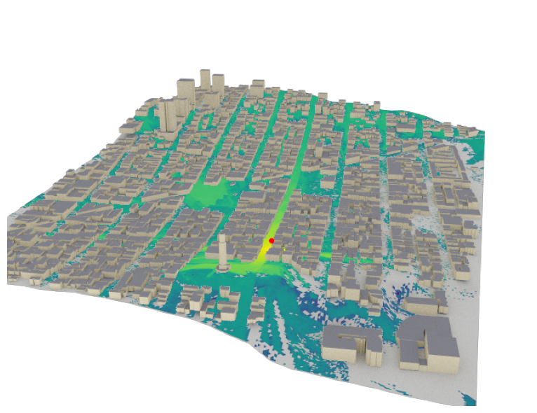

# RaySR (“Racer”): Super-Resolution for Radio Maps

:signal_strength: This project aims to enhance Radio Maps with Super Resolution and is inspired by [DLSS](https://www.nvidia.com/en-gb/geforce/technologies/dlss/). The project is part of the course [DD2430](https://www.kth.se/student/kurser/kurs/DD2430?l=en) at KTH and is done in collaboration with Ericsson.

  
  
     
    <em>Left:</em> Example of a radio map data sample with transmitter (blue). <em>Right:</em> Example of a radio map over San Francisco with transmitter (red).
     

## Results
The table below show results from upsampling the low resolution maps using bicubic interpolation and the trained super resolution model (PAN).

| Metric | Bicubic | PAN |
|---|---|---|
| PSNR | 21.97 | 24.21 |
| SSIM | 0.289 | 0.377 |
| RMSE | 24.21 | 18.69 |

## Setup
1. **Install** [uv](https://github.com/astral-sh/uv) by running ``curl -LsSf https://astral.sh/uv/install.sh | sh``.
2. **Sync environment**: ``uv sync``
3. **Run commands**: ``uv run <command>``
4. **(Dev)**: Install pre-commit hooks: ``pre-commit install``
- Might need `LLVM` installed... 

## Running the POC
See [src/poc/readme.md](src/poc/readme.md) for detailed instructions on how to run the proof of concept code.
Available commands:
- `uv run generate`: Generate synthetic radio map data.
- `uv run train`: Train the super-resolution model.
- `uv run test`: Evaluate the model.

## System Requirements
This codebase is developed and tested on **Linux** systems and **WSL2**.\
Using an NVIDIA GPU for training is recommended. NVIDIA T4 and L4 have been tested.