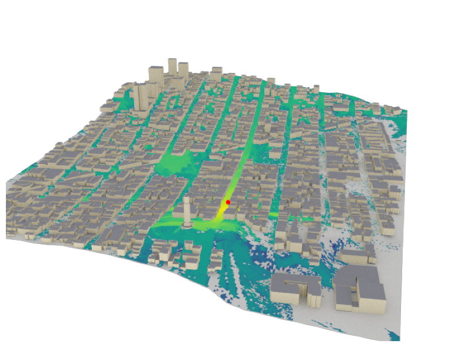

# RaySR (“Racer”): Super-Resolution for Radio Maps

:signal_strength: This project aims to enhance Radio Maps with Super Resolution and is inspired by [DLSS](https://www.nvidia.com/en-gb/geforce/technologies/dlss/). The project is part of the course [DD2430](https://www.kth.se/student/kurser/kurs/DD2430?l=en) at KTH and is done in collaboration with Ericsson.

  
  
     
    <em>Left:</em> Example of a radio map data sample with transmitters (blue). <em>Right:</em> Example of a radio map over San Francisco with transmitters (red).
     

## Setup
1. **Install** [uv](https://github.com/astral-sh/uv).
2. **Sync environment**: ``uv sync``
3. **Run commands**: ``uv run <command>``
4. **(Dev)**: Install pre-commit hooks: ``pre-commit install``
- Might need `LLVM` installed... 

## Environment Instructions
- To add dependencies, add them to `pyproject.toml` and run `uv sync`.
- Optionally, you can use `uv add <package>` to add a package and sync the environment, e.g. `uv add 'requests==2.31.0'`.
